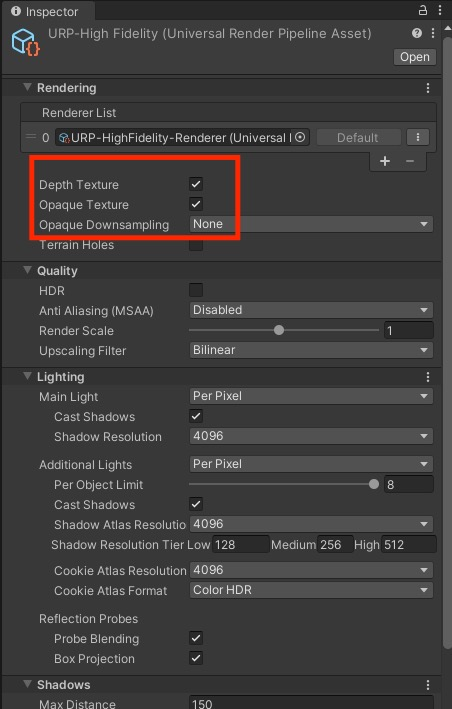
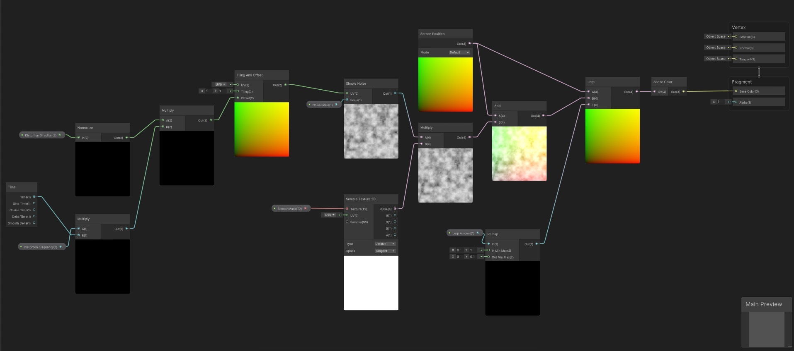

## Distortion Effects in Unity

**Result:** https://www.youtube.com/watch?v=nFBrQayNHow

There are various ways to create distortion effects in Unity. One of them is to access the frame texture through the OnRenderImage callback for the Built-in pipeline and perform a blit operation on this texture. For URP, an equivalent method can be considered as making adjustments on the Opaque Texture within the Render Pipeline Asset. 

You need to enable Opaque Texture option from your Universal Render Pipeline Asset in URP. This way, we will be able to use **"_CameraColorTexture"** in our HLSL file and/or **Screen Color** node in Shader Graph.

The fundamental idea behind obtaining a distortion effect in this method is to distort the screen space UVs before the generated Frame Texture, obtained at Camera's 2500 Queue render, is mapped to the screen. With the distortion of UVs, the image will be placed differently on the screen where the UVs are altered, causing a distortion-like effect. We will use the shader we've created by applying it to a transparent object, which we'll use as a distortion object. The pixels of the Opaque Texture at the location where the object aligns with the screen will be mapped to the screen in a distorted manner.

I'm sharing this shader with you both as a Shader Graph and an HLSL file. The HLSL file has been tested in Unity 2021.3.27f1, while the Shader Graph has been tested in Unity 2021.3.15f1.

~~~HLSL
Shader "Unlit/DistortionShader"
{
	Properties
	{
		[MainTexture]
        _MainTex ("Texture", 2D) = "white" {}
		
        _LerpAmount ("Distortion", Range(0, 10)) = 0.5
		_DistortionDirection ("Direction", Vector) = (0,0,0,0)
		_NoiseScale ("Noise Scale", Float) = 0.5
		_Frequency ("Frequency", Float) = 0.5
	}
	SubShader
	{
		Tags 
		{
			 "RenderType"="Transparent"
			 "Queue" = "Transparent"
		}
		
		Blend SrcAlpha OneMinusSrcAlpha
		ZWrite Off

		Pass
		{
			HLSLPROGRAM
			#pragma vertex vert
			#pragma fragment frag

			#include "Packages/com.unity.render-pipelines.universal/ShaderLibrary/Core.hlsl"
            #include "Packages/com.unity.render-pipelines.universal/ShaderLibrary/Lighting.hlsl"
			
			CBUFFER_START(UnityPerMaterial)
			float _LerpAmount;
			float2 _DistortionDirection;
			float _NoiseScale;
			float _Frequency;
			CBUFFER_END

			TEXTURE2D(_CameraColorTexture); SAMPLER(sampler_CameraColorTexture);
			TEXTURE2D(_MainTex); SAMPLER(sampler_MainTex); uniform float4 _MainTex_ST;

			struct app_data
			{
				float4 vertex : POSITION;
				float2 uv : TEXCOORD0;
			};

			struct interpolators
			{
				float2 uv : TEXCOORD0;
				float4 vertex : SV_POSITION;
				float4 screenPos : TEXCOORD1;
			};
			
			interpolators vert (app_data v)
			{			
				interpolators o;				
				const VertexPositionInputs inputs = GetVertexPositionInputs(v.vertex.xyz);
				o.uv = v.uv;
				o.vertex = inputs.positionCS;
				o.screenPos = inputs.positionNDC;
				
				o.uv = TRANSFORM_TEX(o.uv, _MainTex);
				
				return o;
			}

			inline float unity_noise_randomValue (float2 uv)
			{
			    return frac(sin(dot(uv, float2(12.9898, 78.233)))*43758.5453);
			}

			inline float unity_noise_interpolate (float a, float b, float t)
			{
			    return (1.0-t)*a + (t*b);
			}

			inline float unity_valueNoise (float2 uv)
			{
			    float2 i = floor(uv);
			    float2 f = frac(uv);
			    f = f * f * (3.0 - 2.0 * f);

			    uv = abs(frac(uv) - 0.5);
			    float2 c0 = i + float2(0.0, 0.0);
			    float2 c1 = i + float2(1.0, 0.0);
			    float2 c2 = i + float2(0.0, 1.0);
			    float2 c3 = i + float2(1.0, 1.0);
			    float r0 = unity_noise_randomValue(c0);
			    float r1 = unity_noise_randomValue(c1);
			    float r2 = unity_noise_randomValue(c2);
			    float r3 = unity_noise_randomValue(c3);

			    float bottomOfGrid = unity_noise_interpolate(r0, r1, f.x);
			    float topOfGrid = unity_noise_interpolate(r2, r3, f.x);
			    float t = unity_noise_interpolate(bottomOfGrid, topOfGrid, f.y);
			    return t;
			}

			float Unity_SimpleNoise_float(float2 UV, float Scale)
			{
			    float t = 0.0;

			    float freq = pow(2.0, float(0));
			    float amp = pow(0.5, float(3-0));
			    t += unity_valueNoise(float2(UV.x*Scale/freq, UV.y*Scale/freq))*amp;

			    freq = pow(2.0, float(1));
			    amp = pow(0.5, float(3-1));
			    t += unity_valueNoise(float2(UV.x*Scale/freq, UV.y*Scale/freq))*amp;

			    freq = pow(2.0, float(2));
			    amp = pow(0.5, float(3-2));
			    t += unity_valueNoise(float2(UV.x*Scale/freq, UV.y*Scale/freq))*amp;
				return t;
			}

			float2 get_noise_uv(float2 i)
			{
				return i + normalize(_DistortionDirection) * (_Frequency * _Time.y);
			}
			
			float4 frag (interpolators i) : SV_Target
			{
				float4 texture_value = SAMPLE_TEXTURE2D(_MainTex, sampler_MainTex, i.uv).r;
				float noise = Unity_SimpleNoise_float(get_noise_uv(i.uv), _NoiseScale);
				float4 uvNoise = texture_value  * noise;

				float2 screenUV = i.screenPos / i.screenPos.w;
				float2 noisedUV = screenUV + uvNoise;
				
				float2 currentUV = lerp(screenUV, noisedUV, _LerpAmount);
				float4 col = SAMPLE_TEXTURE2D(_CameraColorTexture, sampler_CameraColorTexture, currentUV);
				return col;
			}
			ENDHLSL
		}
	}
}
~~~~

Shader Graph: <a href="DistortionShaderGraph.unitypackage" download>Click to Download</a>

