# Lighting Basics in Unity

In this document, we'll be discussing lighting settings in Unity.

When we want to add light to our scene in Unity, we can see that Unity offers us four different types of lights.

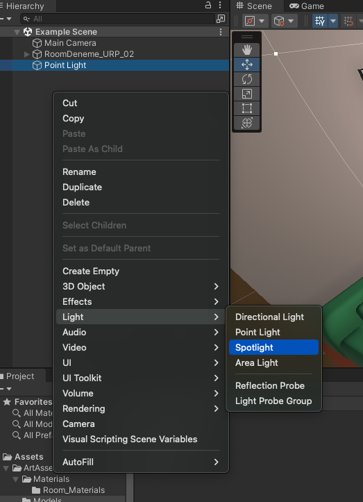

Although most games have only a Directional Light in the scene, there are also options for other types of lights such as Point Light, Spotlight, and Area Light. In every Unity scene, existing lights work in two different groups: **Main Light** and **Additional Lights**.

The main light in the scene is the main light of the scene if there is a light designated as "Sun Source" in the Window / Lighting / Environment window. If no sun source is marked, Unity automatically selects the brightest 'Directional Light' type light in the scene as the Main Light.

Skybox Renderer and Shader files have easy access to the light marked as the main light in the scene and use them for necessary shading calculations.

If there are other lights in the scene besides the main light, make sure that the Additional Lights setting is not disabled in the Universal Render Pipeline Asset used by the project.

Although there can be many lights in a scene, when the project uses the Forward Renderer path, there is a limit to how many different lights an object can be affected by, which is currently 8 lights. If the project uses the Deferred Rendering Path, this limit will only apply to materials that have passes marked as ForwardRendering in their shader, and this limit will be lifted for all other materials.

**Note:** You can find the Render Pipeline Asset file used by the project at Edit / Project Settings / Graphics tab, and you can see where it is located in the project directory by double-clicking.

If there are multiple Directional Lights in the scene and you want to designate the light with less brightness than the others as the Sun source, you can achieve this by marking the Render Mode of only the Directional Light you want as the Main Light as important in the inspector and marking the others as not important. If all directional lights have Render Mode set to auto and the Lighting / Environment / Sun source section is empty, Unity will still automatically select the brightest Directional Light as the main light.

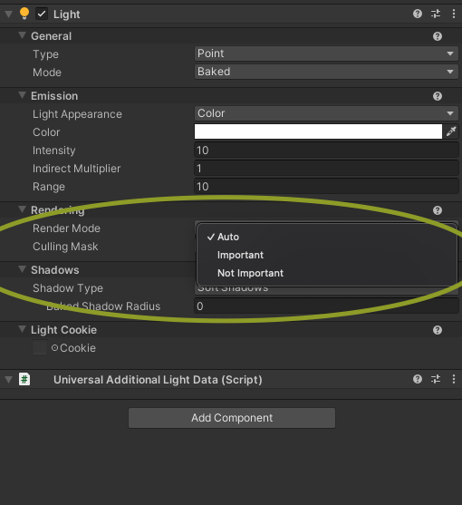

- When we examine the 'Light' component of any Light we added to the scene, we will see the Mode option under the General tab. The Mode setting offers us three options:
  - **Realtime:** Lights using this mode will perform lighting and shading calculations during gameplay. This allows shadows cast by moving (dynamic) objects to behave dynamically based on their movements. For example, shadows cast by our character in the game, just like moving vehicles, will be calculated in real-time, and their shadows will also change shape based on their movements. Although necessary for dynamic objects, it is a method with high performance costs.
  - **Mixed:** Lights using this mode use the 'Baked' mode for objects marked as 'Static' in the scene, while using the Realtime mode for moving objects.
  - **Baked:** Lights using this mode do not perform any calculations during gameplay. They have no effect on dynamic objects. They only transfer the lighting baked in Unity Editor to a texture for objects marked as 'Static'. As a result, a texture called Lightmap is created. During gameplay, objects illuminate themselves by reading the appropriate data from the Lightmap texture. This allows pre-baked, high-quality lighting to be achieved. Since no calculations are performed during gameplay, it is a very efficient method. However, shadows of objects and Ambient Occlusion properties do not change with the object's closure or movement.

## Example Lightmapping Application

1. Make sure the Generate Lightmap UV option is enabled for our models in the scene.

Since I only want interior baked lighting in the scene, I make sure that there is no light in the scene, including the Directional Light. Then, in my hierarchy, I mark the objects that will not move during gameplay as static.

2. In the hierarchy, I mark the objects that will not move during gameplay as static. Baked Lights are not calculated for non-static objects.

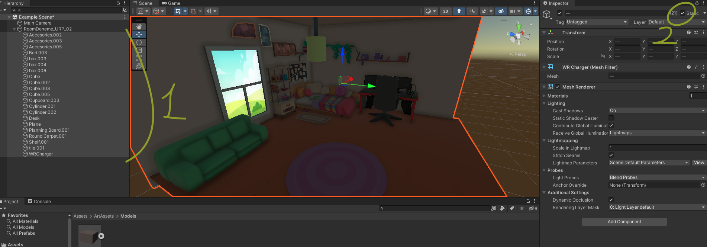

3. I create the lights I want to add to my scene and place them where I want them to be.

4. I set the lighting type of the lights in the scene to "Baked".

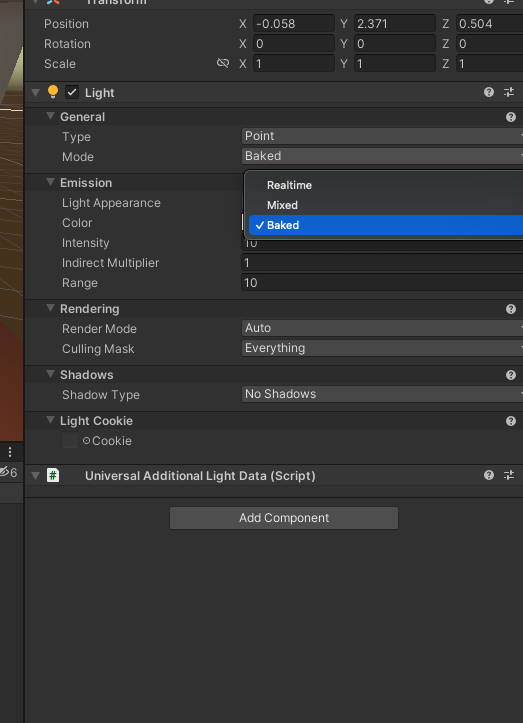

5. If I'm using URP Render Pipeline, I make sure that Additional Lights is not disabled. (Lights other than Directional Light, especially those not marked as main light, are considered Additional Light.)

6. We open the lighting window from the Window / Rendering menu. If we don't have a lighting Settings Asset, we create a new settings asset with the 'New Lighting Settings' button. Under the Mixed Lighting heading, make sure the 'Baked Global Illumination' option is enabled. After configuring the Lightmapping settings, we calculate the lighting for the scene with the 'Generate Lighting' button.

**Sonuç:**

- We achieved high-quality Ambient Occlusion and Shading for static objects. At the same time, by preventing the Shadow pass from being called at runtime for static objects, we gained performance improvement.
- Since static objects are marked not only as Contribute GI but also as Batch mode static, Unity combines these static meshes, thereby reducing the number of draw calls and achieving performance gains.

## Lighting Settings

- **Lighting Mode:** This is a bit complicated. It would be a much more efficient solution for mobile to achieve the desired image using 'Subtractive'. Other options should only be considered when we cannot achieve the desired image.
- **Lightmapper:** The choice of technology used in light creation. Use Progressive GPU if available. It will shorten the calculation time. If using Mac devices, definitely use progressive GPU.
- **Progressive Updates:** Keeping it open extends the total calculation time. However, it allows you to get an idea before all calculations are completed about whether your configuration is good or bad by calculating the priority of where you are looking in your Scene View. It does not work well on Mac devices. If your total calculation time does not exceed 30 seconds to 1 minute, I do not recommend using it.
- **Multiple Importance Sampling:** When enabled, it speeds up system calculation processes. Keep it enabled if you do not experience noise issues in dark scenes. If you experience noise issues, you can try turning it off at the expense of longer calculation times.
- **Direct Samples:** Increasing it does not have a negative impact on game performance. As the number increases, the calculation time also increases significantly, but a higher quality lightmap is obtained. 32 is ideal for the beginning. After obtaining the desired light configuration, increasing it to 64-128 during the final bake process can attempt to achieve higher quality lighting before shipping the game.
- **Indirect Samples:** What is written for Direct Samples is also valid here. 256 is ideal for the beginning. Before shipping, values such as 512 or 1024 can be tried.
- **Light Probe Sample Multiplier:** If used, it determines how detailed the Light Probes will illuminate. Values like 4 - 8 are ideal. Increasing it can significantly extend the calculation time.
- **Min / Max Bounces:** Min can remain at 2, Max at 3. If there are dark areas in the scene, you can try values like 4-6. It adjusts the amount of light tabulation to be calculated in the indirect behavior of light.
- **Filtering:** It should preferably remain on Auto. If there is a Noise issue in the image, it can be tuned.
- **Lightmap Resolution:** It is one of the parameters that most affect the Texture Sizes going to the image and the game's build. It can start from 10 and gradually increase.
- **Max Lightmap Size:** If you experience Bleed issues in the image, you need to increase this value. [Bleed Issue](https://www.reddit.com/r/Unity3D/comments/yczmyv/why_is_my_light_bleeding_through_the_walls/)
- **Ambient Occlusion:** It enables Ambient Occlusion Bake for static objects. It gives results for static objects at least as good as SSAO. It does not work for dynamic objects.
- **Directional Mode:** Keeping it open allows objects' normal maps to be considered in light calculations. When closed, it causes a loss of depth perception depending on the geometry of some objects.
- **Albedo Boost:** It enhances the colors and brightness throughout the scene. It is achieved by multiplying the RGBA values by a coefficient of 1 or greater than 1.
- **Indirect Intensity:** For areas in the scene that are only indirectly illuminated without direct lighting, it creates an Albedo Boost effect.

## Lighting Probes

We created Global Illumination with the lightbaking process. However, if there is no light in any realtime mode in the scene, you will notice that non-static (dynamic) objects receive no light and appear dark.

If you want your dynamic objects to also receive lighting from the lights in 'Baked' mode, you can use lighting probes. Lighting Probes are components that pre-calculate and bake the lights reaching certain points in the scene.

Thanks to probes, dynamic objects check which points the probes determine the amount of lighting for, and apply the lighting they should receive accordingly.

Let's do an example application.

As you can see in the image below, there is a capsule in the scene that receives no lighting because it is not marked as 'Static'. Since all the lights in the scene are in 'Baked' mode, there is no lighting for dynamic objects. Even the Ambient Color is black, making the object appear completely dark. If we do not want to incur the performance cost of making any of the lights in the scene 'Mixed' or 'Realtime', we can use Lighting Probes to apply lighting from the lights in 'Baked' mode to dynamic objects as well.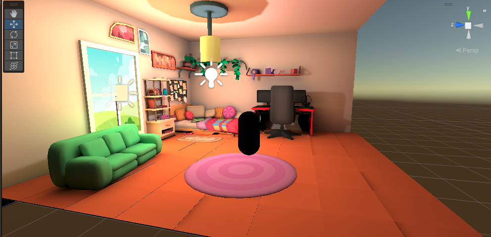

Let's add a Lighting Probe Group to our scene.

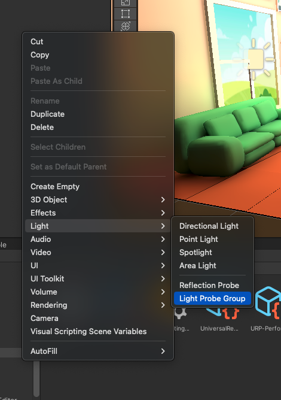

After adding the Lighting Probe Group to the scene, we will encounter the default cubic arrangement. Each yellow sphere gizmo we see in the Scene view represents the location of a light probe. When we perform the light bake process again in Unity, this time, lighting calculations will be made not only for static objects but also for the locations of these yellow spheres. At runtime, dynamic objects will apply the lighting they receive from the nearest probes to themselves.

To achieve a pleasing visual result, it's crucial to adjust the quantity and locations of probes carefully. **It's important to ensure that probes are not contained within any mesh.** Since meshes cannot receive lighting inside them, they will calculate the lighting at that point as darkness, causing objects near those dynamic objects to appear dark.

To increase the number of probes and adjust their locations, you can switch to edit mode by clicking the 'Edit Light Probes' button in the Light Probe Group component. Then, you can make necessary adjustments using the 'Add', 'Duplicate', 'Delete' options on the component.

Note: When adjusting probe locations, with edit mode enabled, you can select and move probes (yellow spheres) multiple times. Necessary adjustments can be made more easily when the Scene view is in isometric or 2D mode.

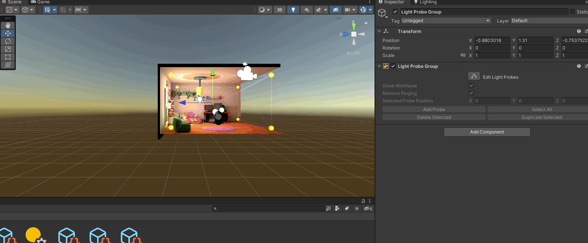

After placing probes or making any modifications to the probes, we need to regenerate lighting by going to Window / Rendering / Lighting and selecting 'Generate Lighting' for the changes to take effect.

After repeating the bake process, as you can see in the image below, our capsule in the scene is no longer dark. If the 'Blend Probes' option is selected under the Light Probes section in the Mesh Renderer component of the capsule, it applies the lighting from the nearest probes to itself inversely proportional to the distance from them.

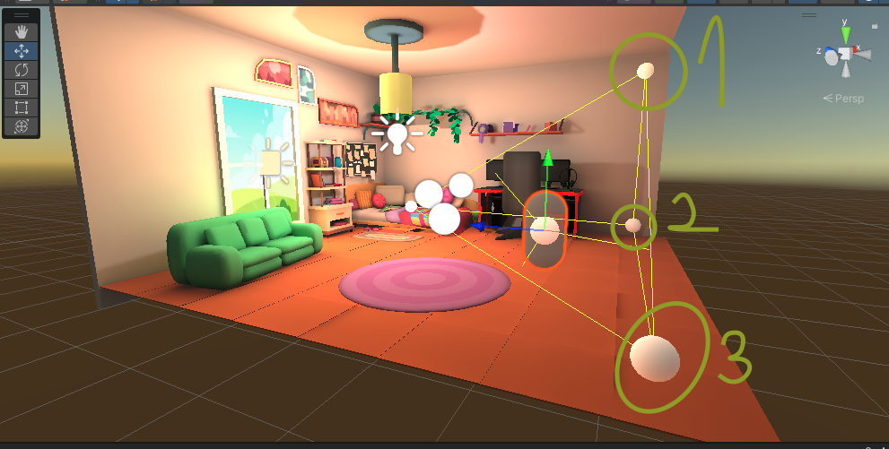

Here, we can see the importance of the placement of probes. We need to place these probes in locations where the behavior of light changes in our scene. For example, let's consider a situation where we do not place any probes in relatively dark or shadowed areas behind a wall or object.

If a dynamic object in a dark area interacts with the nearest probes to it, and if the probes nearby are in bright areas, the object will behave as if it is also receiving that brightness.

In the image below, despite the capsule being behind the wall, because there is no probe on the side where the wall is located, it interacts with the probes inside the room, thus receiving the lighting present in the room.

For the lighting provided by probes to dynamic objects in the scene to be of high quality, we should place probes in locations where the behavior of light changes. (For example, on both the inner and outer surfaces of a wall, under objects such as umbrellas or ceilings that cast shadows on both the top and bottom surfaces.)

In a scenario where we have placed probes on both sides of the wall, we can observe that the capsule now responds differently to being inside and outside the room.

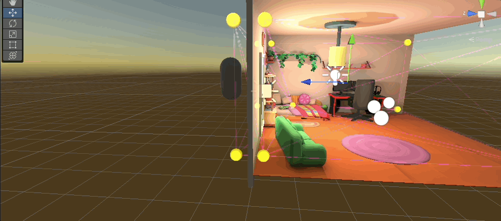

Similarly, placing a probe under the chandelier in the middle of the room due to the presence of a point light and placing another probe in front of the window in the room due to the presence of an area light will enhance the quality of lighting for dynamic objects in the scene.

When we increase the number of probes in the room and place our probes where the behavior of light changes, you can observe that dynamic objects respond more sensibly to lighting.

- 
  As the number of probes in the scene increases, the bake time may extend.
- Unless the number of probes and the scene size increase significantly, the runtime processing costs can be considered nearly zero compared to real-time lighting.
- For shadows of objects affected by global illumination with probes, fake shadow meshes can be used, or a Directional Light in Realtime mode, interacting only with dynamic objects and with culling mask set up to affect only dynamic objects, can be added.

When adding lights to shadow dynamic objects in the scene, you can find some settings that need to be configured under the Shadows section in your Render Pipeline Asset for SRP. If you don't know which Render Pipeline Asset the project is using, you can see it from the Edit / Project Settings / Graphics menu.

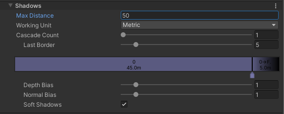

**- Max Distance:** Determines the maximum distance at which shadows of objects will be visible. For example, Unity aims to achieve performance gains by ensuring that shadows of objects beyond 150 units in Unity units are not rendered.

**- Cascade Count:** Determines how many cascades will be used during shadow rendering. If shadows near the camera are too jagged or pixelated, you need to increase this number. The number of cascades directly affects performance. If the cascade count is greater than 1, the number of cascades for distant objects will be less depending on the camera distance. You can adjust how many cascades will be used at what distance using the sliders here.

**- Depth Bias:** Affects the distance between the shadows and the surface of the shadow-casting object. It is configured to address issues like self-shadowing in shadows of meshes with complex geometry.

**- Normal Bias:** Functions similarly to Depth Bias.

**- Soft Shadows:** If not enabled, even if soft shadows are selected in lights, soft shadows cannot be achieved.

## Lightmap Data in Prefabs - Tool

- Unity, precomputed lighting data is kept associated with scene files. There are many limitations to this approach that can be headache-inducing for developers. Although these issues are addressed with Unity 2023, there are various workarounds available in the 2021 version. One of these workarounds is to maintain references to textures that need to be added to the Lightmap on prefabs and add them to the lighting settings when the prefabs are spawned.

  However, there is a drawback to this method, which is the inability to find a way to bake probe data into the prefab yet.

  There are two different ways to use Prefab Lightmaps:

  **1. Prefabricated Mode:**

  - Recommended for scenarios where Lighting Probes are not used. Lightmap data is kept on the prefab. Prefabs spawned in an empty scene come with their own lighting. If your lighting system does not include lighting probes and you bake static objects while using real-time lighting for dynamic objects, you should use this mode.

  **2. Additive Mode:**

  - In scenarios where you use Lighting Probes, since probe data is compiled within Unity, we face issues with keeping this data in prefabs in versions prior to Unity 2023. Therefore, if you use Probes, you will need an empty scene where you bake the lights of the prefab. For example, let's say we have a 'Room' prefab whose lights we bake in a 'Room Scene'. After the bake process, we delete this prefab from the Room scene. Now, our 'Room Scene' only serves as an empty container hierarchy holding Probe data. In this case, no matter which scene we spawn the 'Room' prefab in, a script will load the 'Room Scene' additively to that scene. When the prefab is destroyed, the script unloads this scene.

### Prefabricated Mode Usage
In Unity, we create our prefab in an empty scene and add the Prefab Lightmap Data component to the parent object. We select 'Prefabricated' as the implementation.

After making the necessary light settings in our scene as shown above, we generate our lighting through Window / Rendering / Lighting.

Then, we overwrite this data onto our prefab using the Bake button on the script.

If everything worked smoothly, when we add our prefab to the scene without any light sources, it will now come with its own light data, as shown below.
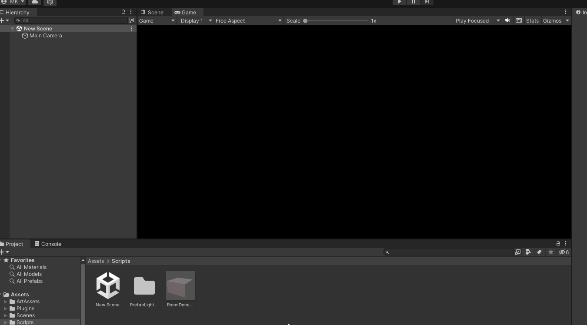

### Additive Mode Usage

In Unity, in an empty scene, we create our prefab and add the Prefab Lightmap Data component to the parent object. We choose 'Additive' as the implementation.

Then, we generate lighting in our scene. We press the bake button on the prefab and overwrite the lightmap data onto the prefab. After that, we delete this prefab from the scene. We save and add this scene, where we performed the Generate operation, to the build settings. We write the exact name as it appears in the build settings into the 'Scene Name' section of the prefab.

Now, whenever we spawn this prefab into any scene, it will load the empty scene where we generated the lighting, including probe data, additively, to bring the light data.

