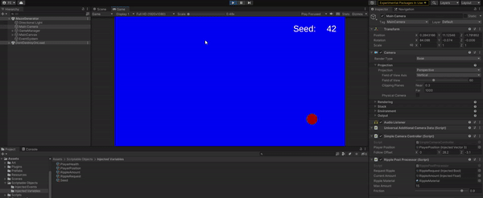

## Procedural Maze Generation


https://www.jamisbuck.org/mazes/

This one is a simple recursive backtracker.




```csharp
using System.Collections.Generic;
using GameName.Gameplay;
using GameName.Gameplay.Combat;
using Unity.AI.Navigation;
using Zenject;

namespace GameName.MazeSystem
{
    using UnityEngine;

    public sealed class LevelGenerator : IInitializable
    {
        [System.Serializable]
        public class LevelGeneratorSettings
        {
            public NavMeshSurface levelGroundPrefab;
            public Vector3 mazeScale;
            public Cell cellPrefab;
            public Waypoint endPointPrefab;
            public Vector2Int mazeGridSize;
            public Vector2 cellPrefabScale;
            public PlayerActor playerActorPrefab;
            public int seed;
            public int enemyCount = 5;
            public bool useRandomSeed;
            public float minDistanceThreshold;
            public float levelSuccessTime;
        }

        private List<Cell> _cells;
        private System.Random _rng;
        private LevelGeneratorSettings _settings;
        private EnemyActor.Factory _enemyFactory;

        [Inject]
        public void Construct(LevelGeneratorSettings set, EnemyActor.Factory enemyFactory)
        {
            _settings = set;
            _enemyFactory = enemyFactory;
        }

        public void Initialize()
        {
            _cells = new List<Cell>(_settings.mazeGridSize.x * _settings.mazeGridSize.y); // prevent memory fragmentation
            if (_settings.useRandomSeed) _settings.seed = (Random.Range(0, 1000));
            GenerateMaze(_settings.mazeGridSize);
            SpawnEnemies();
        }

        private void SetEndPoints()
        {
            Vector3 startPointPosition;
            Vector3 endPointPosition;
            do
            {
                startPointPosition = _cells[GetRandom(0, _cells.Count)].transform.position;
                endPointPosition = _cells[GetRandom(0, _cells.Count)].transform.position;

            } while (Vector3.Distance(startPointPosition, endPointPosition) < _settings.minDistanceThreshold);

            startPointPosition.y = 100f;

            Object.Instantiate(_settings.playerActorPrefab).transform.position = startPointPosition;
            Object.Instantiate(_settings.endPointPrefab).transform.position = endPointPosition;
        }

        private int GetRandom(int minValue, int maxValue)
        {
            if (_rng == null)
            {
                _rng = new System.Random(_settings.seed);
                return _rng.Next(minValue, maxValue);
            }

            return _rng.Next(minValue, maxValue);
        }

        // this method will only be called at start, so i don't worry that much about the GC.
        // i also hate lists and generally prefer hashsets, stacks and queues. but currently i'm on a timer.
        private void GenerateMaze(Vector2Int size)
        {
            GameObject levelParent = new GameObject("Generated Level")
            {
                transform =
                {
                    position = Vector3.zero
                }
            };
            
            Object.Instantiate(_settings.levelGroundPrefab, levelParent.transform);
            
            for (int x = 0; x < size.x; x++)
            {
                for (int y = 0; y < size.y; y++)
                {
                    Vector2 cellPrefabScale = _settings.cellPrefabScale;
                    Vector3 cellPosition = new(x * cellPrefabScale.x - (size.x / 2f), 0, y * cellPrefabScale.y - (size.y / 2f));
                    Cell cellInstance = 
                        Object.Instantiate(_settings.cellPrefab, cellPosition, Quaternion.identity, levelParent.transform);
                    _cells.Add(cellInstance);
                }
            }

            List<Cell> activeCells = new List<Cell>();
            List<Cell> visitedCells = new List<Cell>();

            // choose starting cell
            //activeCells.Add(_cells[Random.Range(0, _cells.Count)]);
            activeCells.Add(_cells[GetRandom(0, _cells.Count)]);
            activeCells[0].UpdateState(CellState.Active);


            while (visitedCells.Count < _cells.Count)
            {
                List<int> possibleNextCells = new List<int>();
                List<WallType> possibleDirections = new List<WallType>();

                int activeNodeIndex = _cells.IndexOf(activeCells[^1]);
                int activeNodeX = activeNodeIndex / size.y;
                int activeNodeY = activeNodeIndex % size.x;

                if (activeNodeX < size.x - 1)
                {
                    if (!visitedCells.Contains(_cells[activeNodeIndex + size.y]) && !activeCells.Contains(_cells[activeNodeIndex + size.y]))
                    {
                        possibleDirections.Add(WallType.PositiveX);
                        possibleNextCells.Add(activeNodeIndex + size.y);
                    }
                }

                if (activeNodeX > 0)
                {
                    if (!visitedCells.Contains(_cells[activeNodeIndex - size.y]) && !activeCells.Contains(_cells[activeNodeIndex - size.y]))
                    {
                        possibleDirections.Add(WallType.NegativeX);
                        possibleNextCells.Add(activeNodeIndex - size.y);
                    }
                }

                if (activeNodeY < size.y - 1)
                {
                    if (!visitedCells.Contains(_cells[activeNodeIndex + 1]) && !activeCells.Contains(_cells[activeNodeIndex + 1]))
                    {
                        possibleDirections.Add(WallType.PositiveZ);
                        possibleNextCells.Add(activeNodeIndex + 1);
                    }
                }

                if (activeNodeY > 0)
                {
                    if (!visitedCells.Contains(_cells[activeNodeIndex - 1]) && !activeCells.Contains(_cells[activeNodeIndex - 1]))
                    {
                        possibleDirections.Add(WallType.NegativeZ);
                        possibleNextCells.Add(activeNodeIndex - 1);
                    }
                }

                if (possibleDirections.Count > 0)
                {
                    // int direction = Random.Range(0, possibleDirections.Count);
                    int direction = GetRandom(0, possibleDirections.Count);
                    Cell cell = _cells[possibleNextCells[direction]];

                    switch (possibleDirections[direction])
                    {
                        case WallType.PositiveX:
                            cell.RemoveWall(WallType.NegativeX);
                            activeCells[^1].RemoveWall(WallType.PositiveX);
                            break;
                        case WallType.NegativeX:
                            cell.RemoveWall(WallType.PositiveX);
                            activeCells[^1].RemoveWall(WallType.NegativeX);
                            break;
                        case WallType.PositiveZ:
                            cell.RemoveWall(WallType.NegativeZ);
                            activeCells[^1].RemoveWall(WallType.PositiveZ);
                            break;
                        case WallType.NegativeZ:
                            cell.RemoveWall(WallType.PositiveZ);
                            activeCells[^1].RemoveWall(WallType.NegativeZ);
                            break;
                    }

                    activeCells.Add(cell);
                    cell.UpdateState(CellState.Active);
                }
                else
                {
                    visitedCells.Add(activeCells[^1]);
                    activeCells[^1].UpdateState(CellState.Visited);
                    activeCells.RemoveAt(activeCells.Count - 1);
                }
            }

            SetEndPoints();
            levelParent.transform.localScale = _settings.mazeScale;
        }

        private void SpawnEnemies()
        {
            for (int i = 0; i < _settings.enemyCount; i++)
            {
                // var enemy = Object.Instantiate(_settings.enemyActorPrefab, GetRandomCellPosition(), Quaternion.identity);
                var enemyFromFactory = _enemyFactory.Create();
                enemyFromFactory.transform.position = GetRandomCellPosition();
                AssignRandomPatrolRoute(enemyFromFactory);
            }

            void AssignRandomPatrolRoute(EnemyActor actor)
            {
                int routeLength = 5;
                actor.Waypoints = new Vector3[routeLength];

                for (int i = 0; i < routeLength; i++)
                {
                    actor.Waypoints[i] = GetRandomCellPosition();
                }
            }

            Vector3 GetRandomCellPosition()
            {
                int randomCellIndex = GetRandom(0, _cells.Count);
                Vector3 randomCellPosition = _cells[randomCellIndex].transform.position;
                randomCellPosition.y = 1f;
                return randomCellPosition;
            }
        }
    }
}
```


```csharp
using System.Linq;
using UnityEngine;
using static GameName.LoggingSystem.CLogger;

namespace GameName.MazeSystem
{
    public sealed class Cell : MonoBehaviour
    {
        [SerializeField]
        private Wall[] cellWalls;
        
        private CellState _currentState = CellState.NotVisited;

        public void OnValidate()
        {
            cellWalls = GetComponentsInChildren<Wall>();
            bool containsAllTypes = false;

            containsAllTypes = cellWalls.Any(w => w.WallType == WallType.PositiveX);
            containsAllTypes = containsAllTypes && cellWalls.Any(w => w.WallType == WallType.NegativeX);
            containsAllTypes = containsAllTypes && cellWalls.Any(w => w.WallType == WallType.PositiveZ);
            containsAllTypes = containsAllTypes && cellWalls.Any(w => w.WallType == WallType.NegativeZ);

            if (!containsAllTypes)
            {
                LogWarning("Check cell wall types, make sure cellWalls contains all directions");
                return;
            } 

            bool noDuplicates = true;
            
            noDuplicates = cellWalls.Count(w => w.WallType == WallType.PositiveX) == 1;
            noDuplicates &= cellWalls.Count(w => w.WallType == WallType.NegativeX) == 1;
            noDuplicates &= cellWalls.Count(w => w.WallType == WallType.PositiveZ) == 1;
            noDuplicates &= cellWalls.Count(w => w.WallType == WallType.NegativeZ) == 1;
            
            if (!noDuplicates)
            {
                LogWarning("Check wall types, make sure there is no duplicates");
            } 
        }

        public void RemoveWall(WallType wallTypeToRemove)
        {
            Wall wallToRemove = cellWalls.First(w => w.WallType == wallTypeToRemove);
            wallToRemove.gameObject.SetActive(false);
        }
        
        public void UpdateState(CellState newState)
        {
            _currentState = newState;
        }
    }
}
```

