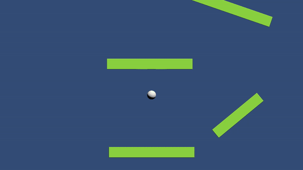

Showcase
--------------

--------------


```csharp
using UnityEngine;
using UnityEngine.Rendering;
using UnityEngine.Rendering.Universal;

namespace BlobFighters.RayMarching
{
    public class RaymarchRenderPass : ScriptableRenderPass
    {
        private static RenderTexture _staticTemporaryRenderTexture;
        private RenderTargetIdentifier source; // a render target identifier points to a texture directly.

        public void SetSource(RenderTargetIdentifier s)
        {
            source = s;
        }

        public override void Execute(ScriptableRenderContext context, ref RenderingData renderingData)
        {
            if (!Application.isPlaying) return;
            if (_staticTemporaryRenderTexture == null)
                _staticTemporaryRenderTexture = new RenderTexture(renderingData.cameraData.cameraTargetDescriptor);

            CommandBuffer cmd = CommandBufferPool.Get("Ray marching as render feature");
            RenderTextureDescriptor cameraTextureDesc = renderingData.cameraData.cameraTargetDescriptor;
            cameraTextureDesc.depthBufferBits = 0;

            Blit(cmd, source, _staticTemporaryRenderTexture);
            RenderTexture rmResult = RMMaster.Instance.ApplyRaymarching(_staticTemporaryRenderTexture);
            Blit(cmd, rmResult, source);

            context.ExecuteCommandBuffer(cmd);
            CommandBufferPool.Release(cmd);
        }
    }
}
```


```csharp
using UnityEngine;
using UnityEngine.Rendering.Universal;

namespace BlobFighters.RayMarching
{
    public class RaymarchRenderFeature : ScriptableRendererFeature
    {
        [SerializeField] private RenderPassEvent @event;

        private RaymarchRenderPass renderPass;

        public override void Create()
        {
            renderPass = new RaymarchRenderPass
            {
                renderPassEvent = @event
            };
        }

        public override void AddRenderPasses(ScriptableRenderer renderer, ref RenderingData renderingData)
        {
            renderPass.SetSource(renderer.cameraColorTarget);
            renderer.EnqueuePass(renderPass);
        }
    }
}
```


```csharp
using System.Collections.Generic;
using UnityEngine;

// ReSharper disable NotAccessedField.Local
// ReSharper disable InconsistentNaming

[DefaultExecutionOrder(-10)]
public class RMMaster : MonoBehaviour
{
    private static RMMaster _singletonMember;
    public ComputeShader raymarching;

    private List<ComputeBuffer> buffersToDispose;
    private Camera cam;
    private Light lightSource;

    private RenderTexture target;

    public static RMMaster Instance
    {
        get
        {
            if (_singletonMember != null) return _singletonMember;

            _singletonMember = FindObjectOfType<RMMaster>();
            return _singletonMember;
        }
    }

    private void Awake()
    {
        DontDestroyOnLoad(this);
    }

    private void Init()
    {
        cam = Camera.main;
        lightSource = FindObjectOfType<Light>();
    }

    public RenderTexture ApplyRaymarching(RenderTexture source)
    {
        Init();
        buffersToDispose = new List<ComputeBuffer>();

        InitRenderTexture();
        CreateScene();
        SetParameters();

        raymarching.SetTexture(0, Source, source);
        raymarching.SetTexture(0, Destination, target);

        int threadGroupsX = Mathf.CeilToInt(cam.pixelWidth / 8.0f);
        int threadGroupsY = Mathf.CeilToInt(cam.pixelHeight / 8.0f);

        raymarching.Dispatch(0, threadGroupsX, threadGroupsY, 1);

        foreach (ComputeBuffer buffer in buffersToDispose) buffer.Dispose();

        return target;
    }

    private void CreateScene()
    {
        List<RaymarchShape> allShapes = new List<RaymarchShape>(FindObjectsOfType<RaymarchShape>());
        List<RaymarchShape> orderedShapes = new List<RaymarchShape>();

        foreach (RaymarchShape shape in allShapes)
        {
            // if (shape.transform.parent != null) continue;

            Transform parentShape = shape.transform;
            orderedShapes.Add(shape);
            shape.numChildren = parentShape.childCount;
            for (int j = 0; j < parentShape.childCount; j++)
                if (parentShape.GetChild(j).TryGetComponent(out RaymarchShape s))
                {
                    orderedShapes.Add(s);
                    orderedShapes[^1].numChildren = 0;
                }
        }

        ShapeData[] shapeData = new ShapeData[orderedShapes.Count];
        for (int i = 0; i < orderedShapes.Count; i++)
        {
            RaymarchShape s = orderedShapes[i];
            Vector3 col = new(s.colour.r, s.colour.g, s.colour.b);
            shapeData[i] = new ShapeData
            {
                position = s.Position,
                scale = s.Scale,
                colour = col,
                blendStrength = s.blendStrength * 3,
                numChildren = s.numChildren,
                shapeType = s.shapeType,
                angleZ = s.transform.eulerAngles.z
            };
        }

        ComputeBuffer shapeBuffer = new(shapeData.Length, ShapeData.GetSize());
        shapeBuffer.SetData(shapeData);
        raymarching.SetBuffer(0, Shapes, shapeBuffer);
        raymarching.SetInt(NumShapes, shapeData.Length);

        buffersToDispose.Add(shapeBuffer);
    }

    private void SetParameters()
    {
        raymarching.SetFloat("_AspectRatio", (float)Screen.width / Screen.height);
        raymarching.SetVector("_WorldSpaceCameraPos", cam.transform.position);
        raymarching.SetMatrix(CameraToWorld, cam.cameraToWorldMatrix);
        raymarching.SetMatrix(CameraInverseProjection, cam.projectionMatrix.inverse);
        raymarching.SetVector(Light1, lightSource.transform.forward);
    }

    private void InitRenderTexture()
    {
        if (target != null && target.width == cam.pixelWidth && target.height == cam.pixelHeight) return;

        if (target != null) target.Release();

        target = new RenderTexture(cam.pixelWidth, cam.pixelHeight, 0, RenderTextureFormat.ARGBFloat, RenderTextureReadWrite.Linear)
        {
            enableRandomWrite = true
        };
        target.Create();
    }

    private struct ShapeData
    {
        public Vector3 position;
        public Vector3 scale;
        public Vector3 colour;
        public float blendStrength;
        public float angleZ;
        public int numChildren;
        public int shapeType;

        public static int GetSize()
        {
            return sizeof(float) * 11 + sizeof(int) * 2;
        }
    }

    #region ShaderPropertyIDs

    private static readonly int Source = Shader.PropertyToID("Source");
    private static readonly int Destination = Shader.PropertyToID("Destination");
    private static readonly int Shapes = Shader.PropertyToID("shapes");
    private static readonly int NumShapes = Shader.PropertyToID("numShapes");
    private static readonly int CameraToWorld = Shader.PropertyToID("_CameraToWorld");
    private static readonly int CameraInverseProjection = Shader.PropertyToID("_CameraInverseProjection");
    private static readonly int Light1 = Shader.PropertyToID("_Light");

    #endregion
}
```


```HLSL
#pragma kernel CSMain

Texture2D Source;
RWTexture2D<float4> Destination;

half4x4 _CameraToWorld;
half4x4 _CameraInverseProjection;

half3 _Light;
bool positionLight;
half _AspectRatio;

static const float maxDst = 20; // furkan
static const float epsilon = 0.01f; // furkan
static const float shadowBias = epsilon * 500; // furkan

struct Shape { 
    
    half3 position;
    half3 size;
    half3 colour;
    float blendStrength;
    float angleZ;
    int numChildren;
    int shapeType; // 0 if sphere, 1 if box
};

StructuredBuffer<Shape> shapes;
int numShapes;

struct Ray
{
    half3 origin;
    half3 direction;
};

// Rotation matrix around the Y axis.
half3x3 rotateY(float theta) {
    float c = cos(theta);
    float s = sin(theta);
    return half3x3(
        half3(c, 0, s),
        half3(0, 1, 0),
        half3(-s, 0, c)
    );
}

half3x3 rotateZ(float theta) {
    float c = cos(theta);
    float s = sin(theta);
    return half3x3(
        half3(c, -s, 0),
        half3(s, c, 0),
        half3(0, 0, 1)
    );
}

// Rotation matrix around the X axis.
half3x3 rotateX(float theta) {
    float c = cos(theta);
    float s = sin(theta);
    return half3x3(
        half3(1, 0, 0),
        half3(0, c, -s),
        half3(0, s, c)
    );
}

float deg2rad(float rad)
{
    return rad * 0.0174532925;
}

half SphereDistance(half3 eye, half3 centre, const half radius)
{
    return distance(eye, centre) - radius;
}

half CubeDistance(half3 eye, half3 centre, half3 size, half angle)
{
    eye = mul(rotateZ(deg2rad(-angle)), eye);
    centre = mul(rotateZ(deg2rad(-angle)), centre);
    half3 o = abs(eye-centre) - size/2;
    half ud = length(max(o,0));
    half n = max(max(min(o.x,0),min(o.y,0)), min(o.z,0));
    return ud+n;
}

float sdBox( half3 p, half3 b )
{
    half3 d = abs(p) - b;
    return min(max(d.x,max(d.y,d.z)),0.0) + length(max(d,0.0));
}

Ray create_ray(const half3 origin, const half3 direction)
{
    Ray ray;
    ray.origin = origin;
    ray.direction = direction;
    return ray;
}

float3 _WorldSpaceCameraPos;

Ray create_camera_ray(half2 uv)
{
    const half3 origin = mul(_CameraToWorld, half4(0,0,0,1)).xyz;
    half3 direction = mul(_CameraInverseProjection, half4(uv,0,1)).xyz;
    direction = mul(_CameraToWorld, half4(direction,0)).xyz;
    direction = normalize(direction);
    return create_ray(origin,direction);
}

Ray create_ortho_camera_ray(half2 uv)
{
    uv.x = uv.x * _AspectRatio;
    float3 ro_ort = _WorldSpaceCameraPos + float3(uv * 5, 0);
    return create_ray(ro_ort, float3(0, 0, 1));
}

half4 blend(const half a, const half b, const half3 colA, const half3 colB, const half k)
{
    half h = clamp(0.5 + 0.5 * (b - a) / k, 0.0, 1.0);
    half kH = k * h;
    const half oneMinusH = 1.0 - h;

    half blendDst = lerp(b, a, h) - kH * oneMinusH;
    half3 blendCol = lerp(colB, colA, h);

    return half4(blendCol, blendDst);
}

half get_shape_distance(Shape shape, half3 eye)
{
    if (shape.shapeType == 0)
        return SphereDistance(eye, shape.position, shape.size.x); // furkan
    else if (shape.shapeType == 1)
        return CubeDistance(eye, shape.position, shape.size, shape.angleZ);
    else if (shape.shapeType == 2)
        return sdBox(eye, shape.position);

    return 300000;
}

float4 get_scene_info(half3 eye)
{
    half global_dst = maxDst;
    half3 global_colour = 1;
    
    for (int i = 0; i < numShapes; i ++)
    {
        const Shape shape = shapes[i];

        const half localDst = get_shape_distance(shape,eye);
        const half3 localColour = shape.colour;
        
        half4 global_combined = blend(global_dst, localDst, global_colour, localColour, shape.blendStrength);
        global_colour = global_combined.xyz;
        global_dst = global_combined.w;        
    }
    return half4(global_colour, global_dst);
}

half3 estimate_normal(half3 p) {
    half x = get_scene_info(half3(p.x+epsilon,p.y,p.z)).w - get_scene_info(half3(p.x-epsilon,p.y,p.z)).w;
    half y = get_scene_info(half3(p.x,p.y+epsilon,p.z)).w - get_scene_info(half3(p.x,p.y-epsilon,p.z)).w;
    half z = get_scene_info(half3(p.x,p.y,p.z+epsilon)).w - get_scene_info(half3(p.x,p.y,p.z-epsilon)).w;
    return normalize(half3(x,y,z));
}

[numthreads(8,8,1)]
void CSMain (uint3 id : SV_DispatchThreadID)
{
    uint width,height;
    Destination.GetDimensions(width, height);

    Destination[id.xy] = Source[id.xy];

    half2 uv = id.xy / half2(width,height) * 2 - 1;
    half rayDst = 0;

    Ray ray = create_ortho_camera_ray(uv);
    int marchSteps = 0;

    while (rayDst < maxDst)
    {
        marchSteps ++;
        float4 scene_info = get_scene_info(ray.origin);
        const float dst = scene_info.w;
        
        if (dst <= epsilon)
        {
            const half3 col = scene_info.xyz;
            const half3 pointOnSurface = ray.origin + ray.direction * dst;
            const half3 normal = estimate_normal(pointOnSurface - ray.direction * epsilon);
            const half lighting = saturate(dot(normal,-_Light));

            Destination[id.xy] = half4(col * lighting ,1);
            break;
        }

        ray.origin += ray.direction * dst;
        rayDst += dst;
    }
}

```


How To Install

--------------
This package uses the [scoped registry] feature to resolve package
dependencies. Open the Package Manager page in the Project Settings window and
add the following entry to the Scoped Registries list:

### 1. Open Edit / Project Settings in Unity


### 2. Go to Package Manager


### 3. On Scoped Registries Window add the keys below

- Name: Enter any name here
- URL: `https://registry.npmjs.com`
- Scope: `com.femiroglu`

### 4. Open Window / Package Manager in Unity


### 5. Select My Registries Option


Now you can install the package from My Registries page in the Package Manager
window.